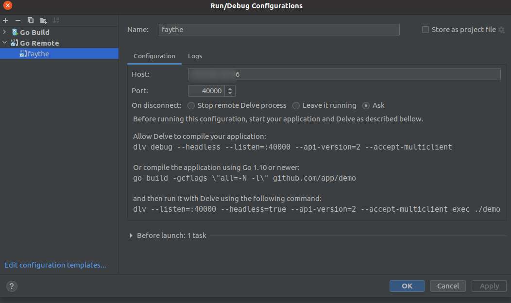

## Setup Remote Debug use GoLand and delve
* Ex setup remote debug for faythe project
### Install delve server
#### Install Go
```
# wget https://golang.org/dl/go1.16.6.linux-amd64.tar.gz
# tar -C /usr/local -xvf go1.16.6.linux-amd64.tar.gz

// Check go version 
# go version
```
#### Setup GOBIN and GOPATH
```
export PATH=$PATH:/usr/local/go/bin
or edit /etc/environment with content
# cat /etc/environment
PATH="/usr/local/sbin:/usr/local/bin:/usr/sbin:/usr/bin:/sbin:/bin:/usr/games:/usr/local/games:/snap/bin:/usr/local/go/bin"

// Setup GOBIN
# export GOBIN=/root/go/bin/
# export PATH=$PATH:/root/go/bin
or edit /etc/environment with content:
PATH="/usr/local/sbin:/usr/local/bin:/usr/sbin:/usr/bin:/sbin:/bin:/usr/games:/usr/local/games:/snap/bin:/usr/local/go/bin:/root/go/bin"
```
### Install Delve
```
# git clone https://github.com/go-delve/delve
# cd delve
# go install github.com/go-delve/delve/cmd/dlv
// check
# dlv version
Delve Debugger
Version: 1.7.0
Build: $Id: 03c66357c10892f8b93d05c77ad27c1f4dd0cb2b $
```
### Build faythe
```
# git clone https://github.com/vCloud-DFTBA/faythe.git
# cd faythe
# go build -mod vendor -o /usr/local/bin/faythe cmd/faythe/main.go
```
### Run faythe with Delve
```
dlv --listen=:40000 --headless=true --api-version=2 --accept-multiclient exec /usr/local/bin/faythe --check-go-version=false
```
### Setup Goland

Select **Run** --> **Edit Configurations** and setup as a picture


*Ref*

https://kupczynski.info/2020/05/17/remote-debug-go-code.html

https://golangbot.com/debugging-go-delve/
