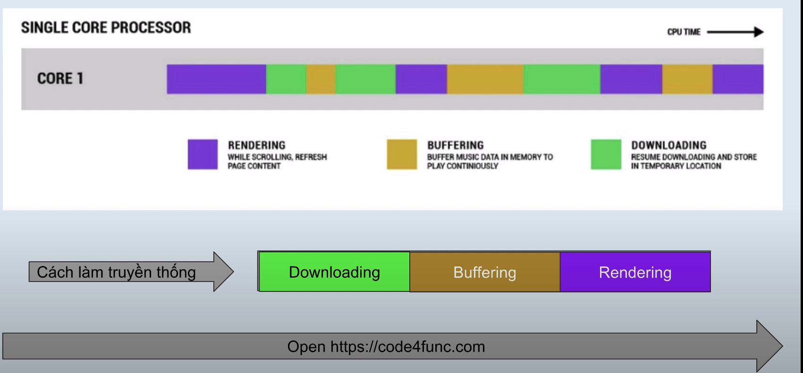
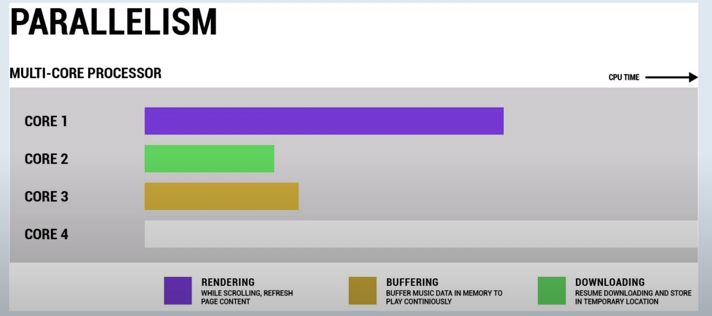
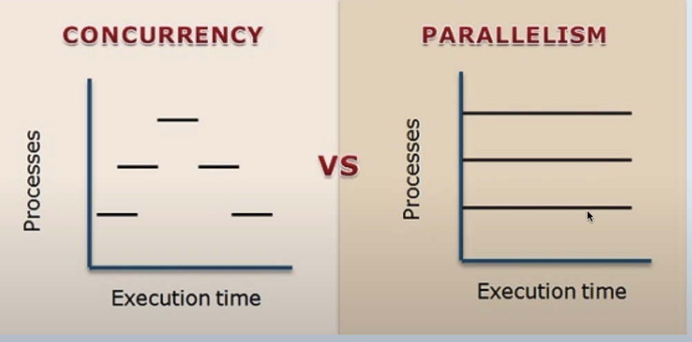
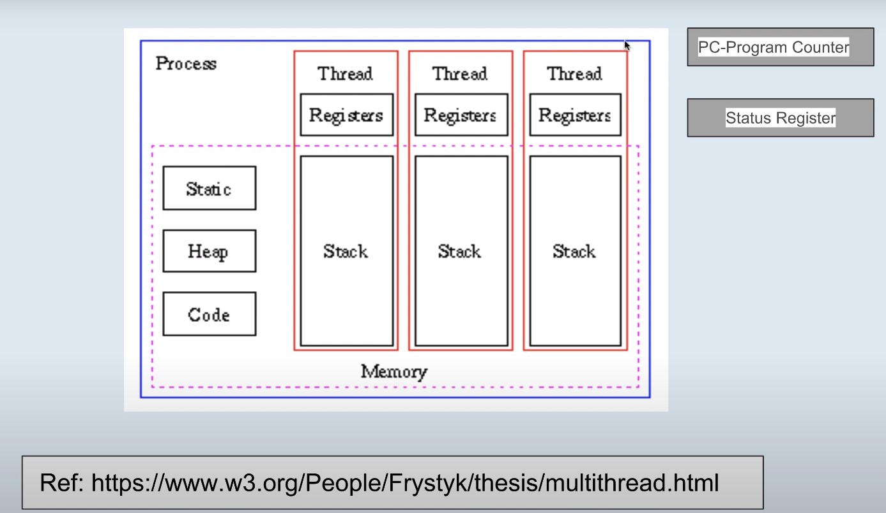
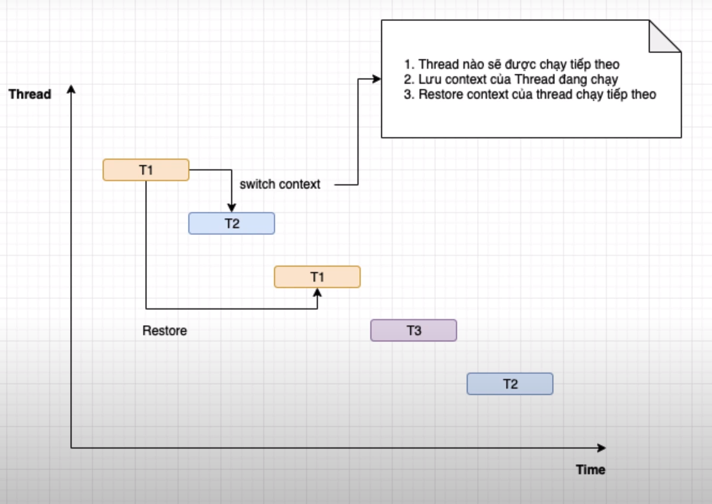
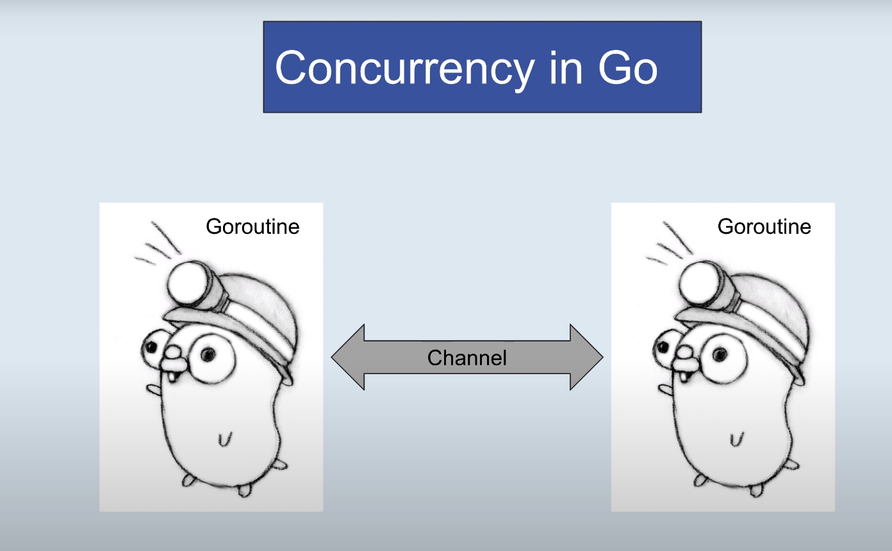
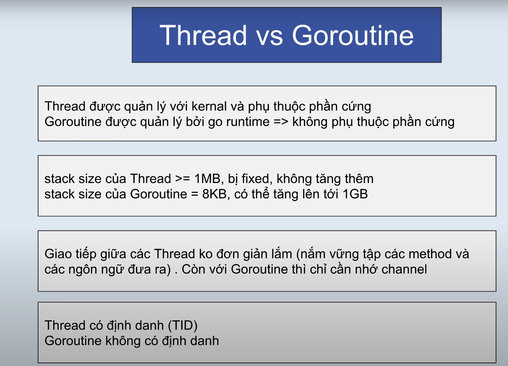

## 1. Khai niem Concurrency

La kha nang 1 chuong trinh co the dieu phoi nhieu tac vu trong cung
mot khoang thoi gian va trong qua trinh dieu phoi chi cho phep 1 tac vu
trong mot thoi diem

Tai sao can concurrency

- Tan dung toi da CPU (1 core or >=2 core)
- Tan dung tinh phan hoi cua ung dung

## 2. Parallelism la gi ??
La kha nang 1 chuong trinh co the thuc thi 2 hoac nhieu task trong cung
mot thoi diem, voi dieu kien CPU phai co tu 2 core tro len

## 3. Thread? and Process?
#### Process

***Static memory***: luu tru cac bien static  
***Heap memory***: Vung nho cap phat dong (khi new obj thi vung nho cho obj se day vao heap)  
***Code memory***: vung nho cho code, va toan bo code do se duoc nap len process  
***Trong 1 process co nhieu Thread***  
***Trong Thread co Registers (thanh ghi)***  
***Thanh ghi PC-Program Counter***: Quan ly dong lenh chay tiep theo (giong debug)  
***Thanh ghi Status***: Luu lai trang thai cua thread

#### Thread

## Concurrenty trong Golang

Trong golang ko co khai niem thread thay vao do dua ra khai niem Goroutine  
De giao tiep giua cac goroutine thi go dua ra khai niem channel

